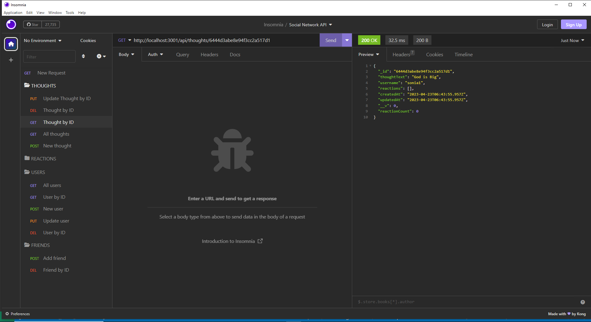

# Social Network API

This is an  application where users can share their thoughts; add friends and add reactions to the thoughts

I run the application by runnig the command npm start in the command line.

When I want to see all the users.I open Insomnia and select "All users".
Then all the users are displayed on the right side.

When I want to add a new user, I select "New user" from the left side in Insomnia, write the username and email in the body and send the request.
THEN the new user is added.

WHEN I want to update a user, I select "Update user" from the left side in Insomnia, write the user Id in the URL, then the attribute name and the corresponding new updated information.
then the user is updated.

When I want to find a user by Id, I select "User by ID", write the the user ID in the URL and press "send".
Then I should see the details of the user.

When I want to delete a user by Id, I select "delete user by ID", write the the user ID in the URL and press "send".
Then the user is deleted.

When I want to see all the thoughts.I open Insomnia and select "All thoughts".
Then all the thoughts are displayed on the right side.

When I want to add a new thought, I select "New thought" from the left side in Insomnia, write the corresponding thoughtText, username and email in the body and send the request.
THEN the new thought is added.

WHEN I want to update a thought, I select "Update Thought by ID" from the left side in Insomnia, write the user Id in the URL, then the attribute name and the corresponding new updated information.

When I want to find a user by Id, I select "User by ID", write the the user ID in the URL and press "send".
Then I should see the details of the user.

When I want to delete a user by Id, I select "delete user by ID", write the the user ID in the URL and press "send".
Then the user is deleted.

When I want to add a friend. I select "Add friend", put in the URL the user ID of the person who wants a friend, then I write in the same URl the ID of the user who is going to be added as a friend.

when I want to remove a friend. I select "Delete friend", put in the URL the user ID of the person who wants to delete of of his friends, then I write in the same URl the ID of the user who is going to be deleted as a friend.

Link to the walk trough video. There are 2 videos, the second video is a very short one, the continuation of video 1 :

<https://drive.google.com/file/d/1eNhjYF_2Jy9jAKtqScO4PpXA-130d2TY/view>
<https://drive.google.com/file/d/1j9Sl-fRDRmuatXMD7Nzqlp0xSrSyYLrm/view>

GitHub Repository:

<https://github.com/katita81/socialNetworkApi.git>

